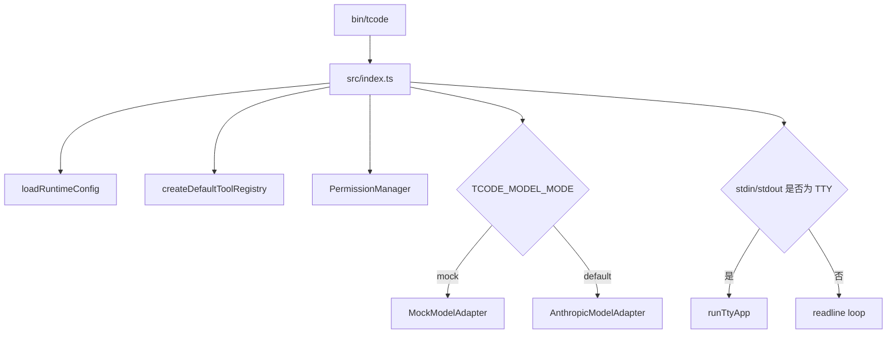

# tcode 技术说明文档

## 1. 项目概述

`tcode` 是一个轻量级终端编码助手 CLI。它的核心目标不是复刻完整 IDE agent 平台，而是在终端里实现一条可理解、可审计、可扩展的 coding agent 闭环：

1. 接收用户自然语言输入
2. 将上下文和工具定义发送给模型
3. 模型决定是否调用本地工具
4. 本地执行读文件、改文件、搜索、跑命令等操作
5. 将工具结果回传给模型
6. 模型输出最终答复

项目使用 TypeScript 编写，运行在 Node.js 18+ 环境中。依赖保持很少，核心运行时只依赖 `zod` 做工具入参校验，终端 UI 也没有引入 React/Ink，而是直接使用 ANSI 控制序列和原生 stdin/stdout 实现。

## 2. 启动与入口

项目的命令入口定义在 `package.json`：

- `bin/tcode`：npm bin 入口，用于启动 CLI。
- `npm start`：开发模式下通过 `tsx src/index.ts` 运行。
- `npm run install-cli`：执行安装脚本，将 launcher 写入本机可执行路径。

主入口是 `src/index.ts`。启动时会完成以下初始化：

1. 调用 `loadRuntimeConfig()` 读取模型配置。
2. 调用 `createDefaultToolRegistry()` 注册内置工具。
3. 创建 `PermissionManager`，加载路径、命令、编辑相关权限。
4. 根据 `TCODE_MODEL_MODE` 选择真实模型适配器或 Mock 适配器。
5. 调用 `buildSystemPrompt()` 构造 system prompt。
6. 根据当前是否为 TTY 终端，选择全屏 TUI 模式或普通 readline 模式。

整体启动链路如下：



## 3. 配置体系

配置相关代码集中在 `src/config.ts`。

`tcode` 使用 `~/.tcode` 作为自己的本地数据目录，当前包含：

- `settings.json`：模型、环境变量等运行配置。
- `permissions.json`：用户持久化批准或拒绝的权限规则。
- `history.json`：TUI 输入历史。

配置加载时会合并三类来源：

1. `~/.claude/settings.json`
2. `~/.tcode/settings.json`
3. 当前进程环境变量 `process.env`

其中 `~/.tcode/settings.json` 会覆盖 `~/.claude/settings.json`，进程环境变量优先级最高。运行时主要读取：

- `TCODE_MODEL` 或 `ANTHROPIC_MODEL`：模型名称。
- `ANTHROPIC_BASE_URL`：Anthropic 兼容接口地址，默认是 `https://api.anthropic.com`。
- `ANTHROPIC_AUTH_TOKEN` 或 `ANTHROPIC_API_KEY`：认证信息。
- `TCODE_MODEL_MODE=mock`：启用本地 Mock 模型。

## 4. 交互模式

### 4.1 TUI 模式

当 stdin 和 stdout 都是 TTY 时，程序进入 `src/tty-app.ts` 实现的全屏 TUI。

TUI 启动后会进入 alternate screen，开启 raw mode，并接管键盘输入。界面状态由 `ScreenState` 管理，主要包括：

- 当前输入框内容和光标位置
- transcript 对话记录
- transcript 滚动位置
- slash 命令菜单状态
- 当前运行中的工具
- 最近执行的工具结果
- 输入历史
- 等待用户确认的权限请求

渲染逻辑由 `renderScreen()` 统一调度，依次绘制：

1. 顶部 banner
2. transcript
3. 输入框
4. slash 命令菜单
5. 权限审批弹窗
6. 工具状态面板
7. 底部状态行

底层 UI 组件位于 `src/tui/*`：

- `screen.ts`：清屏、切换 alternate screen、光标显示隐藏。
- `transcript.ts`：渲染用户、助手、工具三类消息。
- `input.ts`：渲染输入框和光标。
- `chrome.ts`：渲染 banner、状态行、工具面板、slash 菜单、权限弹窗。
- `markdown.ts`：对 assistant 输出做简易 markdown 着色。
- `input-parser.ts`：解析按键、组合键、滚轮等输入事件。

### 4.2 readline 模式

当程序运行在非 TTY 环境中时，会进入普通 readline 循环。这种模式适合脚本或管道场景。

readline 模式仍然走同一套 Agent Loop 和工具系统，但没有全屏 UI，也无法弹出交互式权限审批。因此需要审批的 cwd 外路径、危险命令、文件编辑等操作会直接失败，并提示用户在 TTY 模式下批准。

## 5. Agent 主循环

Agent 主循环位于 `src/agent-loop.ts`，核心函数是 `runAgentTurn()`。

它接收当前消息列表、模型适配器、工具注册表、cwd、权限管理器等参数，然后在最多 `maxSteps` 步内循环执行：

1. 调用 `model.next(messages)` 请求模型。
2. 如果模型返回 assistant 文本，当前回合结束。
3. 如果模型返回工具调用，逐个执行工具。
4. 将工具调用和工具结果追加进消息列表。
5. 带着新的消息列表继续请求模型。
6. 达到最大步数后停止，返回限制提示。

内部消息类型定义在 `src/types.ts`，主要有：

- `system`：系统提示词。
- `user`：用户输入。
- `assistant`：模型文本回复。
- `assistant_tool_call`：模型发起的工具调用。
- `tool_result`：本地工具执行结果。

一次自然语言请求的典型链路如下：

```mermaid
sequenceDiagram
  participant User as 用户
  participant App as TUI/readline
  participant Loop as runAgentTurn
  participant Model as ModelAdapter
  participant Tools as ToolRegistry
  participant Perm as PermissionManager

  User->>App: 输入需求
  App->>Loop: 传入 messages
  Loop->>Model: next(messages)
  Model-->>Loop: 返回 tool_calls 或 assistant
  alt 返回工具调用
    Loop->>Tools: execute(toolName, input)
    Tools->>Perm: 检查路径/命令/编辑权限
    Perm-->>Tools: 允许或拒绝
    Tools-->>Loop: tool_result
    Loop->>Model: 带工具结果继续请求
  else 返回最终文本
    Loop-->>App: assistant message
    App-->>User: 渲染/打印回复
  end
```

`runAgentTurn()` 还实现了一个轻量的自动续跑机制：当用户明确要求“修改、实现、修复、生成”等动作，而模型只返回计划或前置说明时，它会自动追加一条内部 user 消息，要求模型立即使用工具继续执行。该机制最多触发两次，避免无限循环。

## 6. 模型适配

模型接口通过 `ModelAdapter` 抽象，统一暴露：

```ts
next(messages): Promise<AgentStep>
```

当前有两个实现。

### 6.1 AnthropicModelAdapter

`src/anthropic-adapter.ts` 实现了 Anthropic Messages API 兼容适配。

它负责把内部消息结构转换成 Anthropic API 需要的格式：

- `system` 消息合并为 API 的 `system` 字段。
- `user` 和 `assistant` 文本转换为 text content block。
- `assistant_tool_call` 转换为 `tool_use` block。
- `tool_result` 转换为 user 侧的 `tool_result` block。

请求时会把工具注册表中的工具定义转换成 API 的 `tools` 字段，包括工具名称、描述和 JSON Schema 入参结构。

响应解析时：

- 如果返回 `tool_use` block，则转换为 `type: "tool_calls"`。
- 如果只返回 text block，则转换为 `type: "assistant"`。

因此上层 Agent Loop 不关心具体模型协议，只关心下一步是“输出文本”还是“调用工具”。

### 6.2 MockModelAdapter

`src/mock-model.ts` 提供本地 Mock 模型。开启方式是设置：

```sh
TCODE_MODEL_MODE=mock
```

Mock 模型主要用于无 API Key 或调试工具闭环时验证项目骨架。它会根据输入生成简单的工具调用或固定回复，收到工具结果后再包装成 assistant 文本返回。

## 7. 工具系统

工具协议定义在 `src/tool.ts`。

每个工具都是一个 `ToolDefinition`，包含：

- `name`：工具名，供模型调用。
- `description`：工具说明，发给模型。
- `inputSchema`：JSON Schema 形式的入参定义，发给模型。
- `schema`：Zod schema，用于本地运行前校验。
- `run()`：实际执行逻辑。

工具由 `ToolRegistry` 统一管理。执行工具时会按以下顺序处理：

1. 根据名称查找工具。
2. 使用 Zod 校验入参。
3. 调用工具自己的 `run()`。
4. 捕获异常并转换为统一的 `{ ok, output }`。

默认工具在 `src/tools/index.ts` 注册：

- `list_files`：列出目录内容。
- `grep_files`：按文本搜索文件。
- `read_file`：读取文件内容，支持 offset/limit 分块。
- `write_file`：写入文件。
- `modify_file`：替换整个文件内容。
- `edit_file`：基于 search/replace 精确编辑。
- `patch_file`：应用多段文本替换补丁。
- `run_command`：执行白名单内的本地命令。

路径解析逻辑位于 `src/workspace.ts`。工具访问文件前会将相对路径解析到 cwd 下；如果启用了权限管理器，则通过 `PermissionManager` 决定是否允许访问 cwd 外路径。

## 8. 文件修改实现

文件写入类工具不会直接静默覆盖文件，而是统一走 `src/file-review.ts` 中的写前 review 流程。

典型流程是：

1. 读取旧文件内容。
2. 计算新旧内容的 unified diff。
3. 调用 `permissions.ensureEdit(targetPath, diffPreview)`。
4. 在 TUI 中展示 diff 预览并等待用户确认。
5. 用户批准后再写入磁盘。

`write_file`、`modify_file`、`edit_file`、`patch_file` 都复用这条链路，只是生成目标内容的方式不同：

- `write_file` 直接使用模型提供的新内容。
- `modify_file` 用新内容替换整个文件。
- `edit_file` 要求旧文本唯一匹配后替换为新文本。
- `patch_file` 按多段 patch 顺序修改文件。

这样做的好处是：模型可以提出修改，但真正落盘前仍由用户通过 diff 做最终确认。

## 9. 命令执行实现

命令执行工具位于 `src/tools/run-command.ts`。

它不是任意 shell 执行器，而是有两层限制：

1. 工具层白名单：只允许执行明确列出的命令。
2. 权限层危险命令审批：对可能破坏本地状态或影响远端的命令追加确认。

权限层的危险命令检测在 `src/permissions.ts` 中实现，当前会特别识别：

- `git reset --hard`
- `git clean`
- `git checkout --`
- `git restore --source`
- `git push --force`
- `npm publish`
- `node`、`python3`、`bun` 等可执行任意本地代码的命令

如果用户选择“always allow”或“always deny”，结果会持久化到 `~/.tcode/permissions.json`。

## 10. 权限模型

权限系统由 `PermissionManager` 负责，代码位于 `src/permissions.ts`。

当前有三类权限：

1. `path`：访问 cwd 之外的目录或文件。
2. `command`：执行危险命令。
3. `edit`：应用文件修改。

每次审批都有四种决策：

- `allow_once`：本次允许。
- `allow_always`：持久化允许。
- `deny_once`：本次拒绝。
- `deny_always`：持久化拒绝。

cwd 内路径默认允许，cwd 外路径默认需要审批。没有 TUI prompt handler 时，权限管理器不会擅自批准，而是直接抛出错误。

权限摘要会被注入 system prompt，让模型知道当前 cwd、额外允许目录、危险命令 allowlist、可信编辑目标等边界。

## 11. Slash 命令与本地快捷工具

Slash 命令定义在 `src/cli-commands.ts`。它们不经过模型，而是在本地直接处理，例如：

- `/help`：查看命令帮助。
- `/status`：查看当前状态。
- `/model`：查看模型配置。
- `/config-paths`：查看配置文件路径。
- `/permissions`：查看权限文件位置。

另有一组本地工具 shortcut 在 `src/local-tool-shortcuts.ts` 中解析，例如 `/ls`、`/grep`、`/read`、`/write`、`/modify`、`/edit`、`/patch`、`/cmd`。

这类 shortcut 会绕过模型，直接调用 `ToolRegistry.execute()`，适合用户明确知道自己要执行哪一个工具的场景。

## 12. 输入历史

输入历史由 `src/history.ts` 管理，只记录用户输入，不记录完整对话。

历史文件位于：

```text
~/.tcode/history.json
```

TUI 模式下，用户可以通过方向键或 Ctrl 组合键浏览历史输入。当前最多保留最近 200 条。

这意味着项目目前还没有完整的 session restore 能力，关闭终端后对话上下文不会恢复，只有输入历史会被保留。

## 13. System Prompt 构造

`src/prompt.ts` 负责构造 system prompt。它会包含：

- assistant 的行为准则
- 当前 cwd
- 权限摘要
- 工具使用约束
- 可选的用户级或项目级 `CLAUDE.md` 内容

每轮用户输入前，入口层会重新构造 system prompt，从而让权限变化及时反映给模型。

## 14. 扩展方式

### 14.1 新增工具

新增工具通常需要三步：

1. 在 `src/tools/` 下新增一个工具文件，实现 `ToolDefinition`。
2. 使用 Zod 定义本地入参校验 schema，同时提供给模型使用的 `inputSchema`。
3. 在 `src/tools/index.ts` 中加入默认注册列表。

如果工具需要访问文件系统，应通过 `resolveToolPath()` 和 `PermissionManager` 复用现有路径边界。如果工具会修改文件，应复用 `applyReviewedFileChange()`，保证写前 diff review。

### 14.2 更换模型

如果目标模型兼容 Anthropic Messages API，只需要调整 `ANTHROPIC_BASE_URL`、认证信息和模型名称即可。

如果模型协议不同，可以新增一个 `ModelAdapter` 实现，把项目内部的 `ChatMessage[]` 转换成目标模型协议，再把响应转换回 `AgentStep`。

### 14.3 扩展 TUI

TUI 的渲染入口集中在 `renderScreen()`。新增界面区域时，通常需要：

1. 扩展 `ScreenState`。
2. 在输入事件或 agent 回调中更新状态。
3. 在 `src/tui/*` 中新增渲染函数。
4. 在 `renderScreen()` 中加入对应组件。

## 15. 当前边界

项目目前刻意保持轻量，因此有一些明确边界：

- 没有完整会话持久化，只有输入历史。
- 没有 LSP、IDE bridge、remote session、多 agent 编排。
- 非 TTY 模式不能做交互式审批。
- 命令执行受白名单限制，不是通用 shell。
- TUI 是原生终端渲染，功能比完整 UI 框架更克制。
- 模型适配主要面向 Anthropic Messages API 及其兼容实现。

这些边界让第一版实现保持简单，也让后续扩展点更清晰：先稳定 Agent Loop、工具协议、权限边界和 TUI 交互，再逐步增加更复杂的能力。

